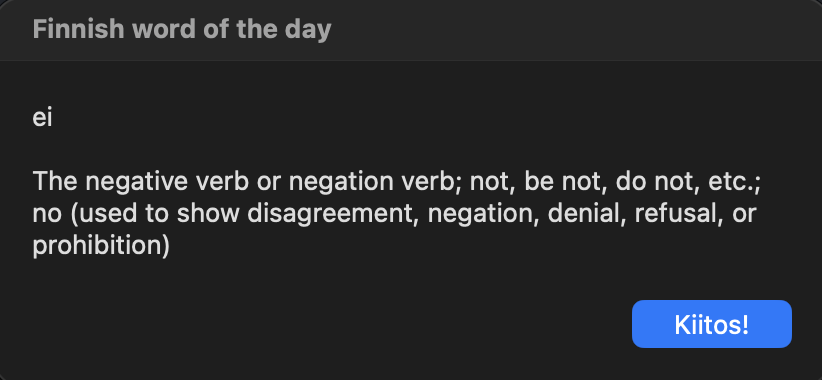

# wotd: Finnish word of the day for macOS

A tiny tool that shows you one Finnish word, and what it means, every time
you open your MacBook. Same word all day, a new one tomorrow. It picks the
most common words first and restocks itself from the web when it runs low.

I built it because I wanted Finnish vocabulary to find me, instead of having
to remember to open an app.



## Features

- **Pops up when you come back to your Mac.** It shows on every wake and
  unlock, waits until you're past the lock screen, and never doubles up.
- **Useful words first.** It works down a list of the 50,000 most common
  Finnish words, with English meanings from Wiktionary.
- **Refills itself.** When fewer than 15 unseen words are left, it quietly
  fetches 30 more. If you're offline, it tries again later without skipping
  anything.
- **Add your own words.** `wotd add kissa "cat"`, and your words come up
  before the web ones.
- **No duplicates.** `Kissa`, ` kissa ` and `kissa` are the same word, and so
  are the two different ways a computer can store `ä` and `ö`.
- **Nothing to install.** It uses only the Python standard library, SQLite and
  Apple's own developer tools.

## Requirements

- macOS
- Apple's Command Line Tools, which provide `python3`, `git` and the Swift
  compiler. If you don't have them yet, run `xcode-select --install`.

## Install

```bash
git clone https://github.com/the5pecial0ne/wotd.git
cd wotd
./install.sh
```

The installer copies everything into `~/wotd`, builds the wake listener,
downloads your first 30 words and starts the background job. Your first word
pops up a few seconds later.

macOS may show a "Background Items Added" notice for `wotd-listener`. That's
this tool.

## Usage

Open a new Terminal window after installing so the `wotd` command exists.

| Command | What it does |
|---|---|
| `wotd` | Print today's word in the terminal |
| `wotd add kissa "cat"` | Add a word of your own |
| `wotd import 50` | Fetch 50 more words right now |
| `wotd stats` | How many words you have and how many you haven't seen yet |
| `wotd show` | Pop up today's word again |

## How it works

```
macOS: "the screen woke up" / "the screen was unlocked"
                    │
                    ▼
      wotd-listener (Swift)  ──runs──▶  wotd.py show  ──▶  popup
                                            │
                                            ▼
                                    words.db (SQLite)
                                            ▲
                                            │ tops up when low
                          frequency word list + Wiktionary
```

- **`wotd-listener.swift`** is a small background process kept alive by
  launchd. It doesn't poll anything. It sleeps until macOS announces that the
  screen woke or was unlocked, then runs `wotd.py show`.
- **`wotd.py`** does everything else: it stores words in SQLite, picks today's
  word, fetches new words with `curl` and shows the popup with `osascript`.
- **Duplicates** are stopped by a `UNIQUE` constraint in the database, after
  every word has been lowercased, trimmed and Unicode-normalized.
- **Meanings** are cleaned up before saving. Grammar-form entries like
  "genitive singular of talo" are skipped in favor of the base word, and
  leftover markup is removed.

## Project structure

```
wotd.py               the app: storage, word picking, web import, popup
wotd-listener.swift   waits for wake/unlock events and triggers the popup
install.sh            builds the listener and registers it with launchd
```

Your personal data (`words.db`, the downloaded word list and the log) lives
in `~/wotd` and is never part of the repository.

## Uninstall

```bash
~/wotd/install.sh uninstall   # stops the popups and keeps your words
rm -rf ~/wotd                 # removes everything, words included
```

## Ideas for later

- Spaced repetition, so words you struggled with come back sooner
- Pronunciation, using macOS's built-in Finnish voice (`say -v Satu`)
- Support for other languages. Swedish would need only a different word list.

## Credits

- Word frequencies come from [FrequencyWords](https://github.com/hermitdave/FrequencyWords)
  by Hermit Dave.
- Meanings come from [English Wiktionary](https://en.wiktionary.org/), whose
  content is available under CC BY-SA.

Neither dataset is included in this repository. Both are downloaded on your
own machine when the tool runs.

## License

MIT
